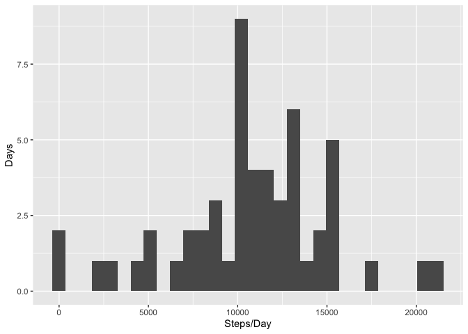
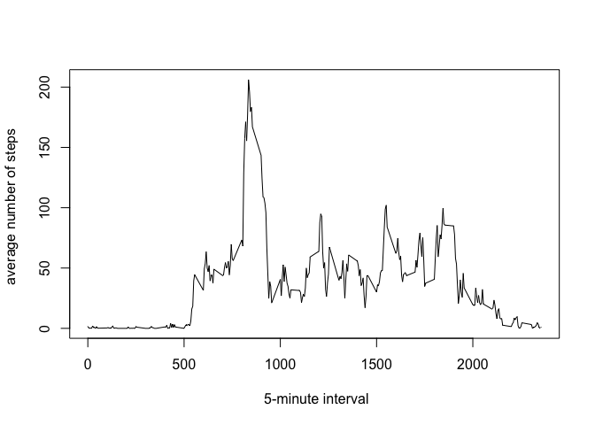
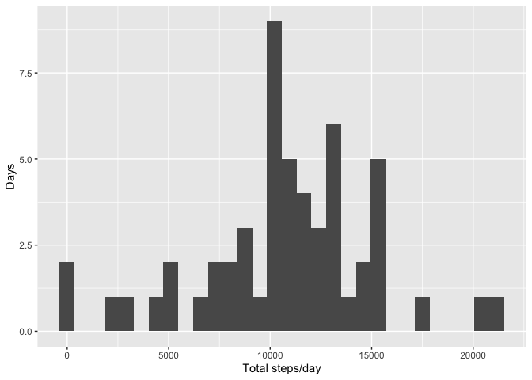
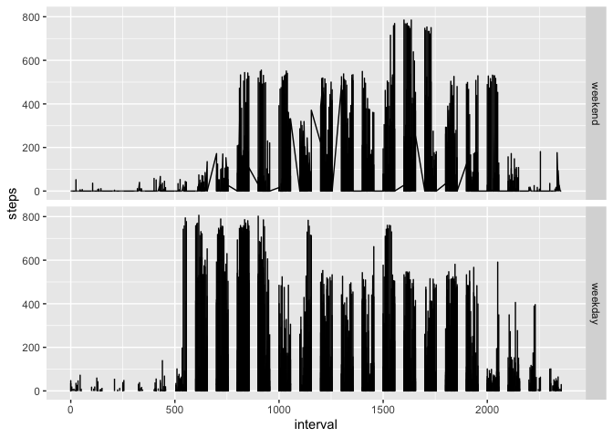

## Loading and preprocessing the data


```r
dataset <- read.csv(file = 'activity.csv', stringsAsFactors = FALSE, sep = ',')
```

## What is mean total number of steps taken per day?


```r
library(ggplot2)
na_remove <- na.omit(dataset)
sum_steps <- aggregate(steps~date, data = na_remove, FUN = sum)
qplot(sum_steps$steps, xlab = "Steps/Day", ylab = "Days", geom = "histogram")
```

```
## `stat_bin()` using `bins = 30`. Pick better value with `binwidth`.
```

<!-- -->


```r
mean_steps <- mean(sum_steps$steps, na.rm = TRUE)
mean_steps
```

```
## [1] 10766.19
```

```r
median_steps <- median(sum_steps$steps, na.rm = TRUE)
```

The mean and median of the total number of steps per day is 10766.19 and 10765 respectively.

## What is the average daily activity pattern?

```r
mean_steps_interval <- aggregate(steps~interval, data = na_remove, FUN = mean)
plot(mean_steps_interval$interval, mean_steps_interval$steps, xlab = " 5-minute interval", ylab = "average number of steps ", type="l")
```

<!-- -->

```r
sub_interval <- subset(mean_steps_interval, steps==max(mean_steps_interval$steps))
```

The **835** 5-minute interval, on average across all the days in the dataset, contains the maximum number of steps.

## Imputing missing values


```r
na_row <- sum(colSums(is.na(dataset)))
```
The total number of missing values in the dataset is **2304**.


```r
library(ggplot2)
## calculate average steps of each interval
ave_interval_steps <- aggregate(steps~interval, data = dataset, FUN = mean)

## Get interval values of original dataset where there's NA
na_df <- subset(dataset, is.na(steps), )
na_interval <- na_df$interval

# Get mean values of intervals whose steps are NAs
cutoffstep <- subset(ave_interval_steps, interval == na_interval, )
replace_steps <- cutoffstep$steps
dataset[is.na(dataset)] <- replace_steps
new_dataset <- dataset

# Make a histogram of the total number of steps each day
library(ggplot2)
steps_day <- aggregate(steps~date, data = new_dataset, FUN = sum)
qplot(steps_day$steps, xlab = "Total steps/day", ylab = "Days", geom = "histogram")
```

```
## `stat_bin()` using `bins = 30`. Pick better value with `binwidth`.
```

<!-- -->

```r
new_mean_steps <- mean(steps_day$steps)
new_median_steps <- median(steps_day$steps)
new_mean_steps
```

```
## [1] 10766.19
```

```r
new_median_steps
```

```
## [1] 10765.59
```
The new mean and median total number of steps each day is **10766.19** and **10765.59** respectively.
There's no difference compared to the mean and median in assignment 1.

## Are there differences in activity patterns between weekdays and weekends?


```r
## Add a factor variable to the dataset
new_dataset$date <- as.Date(new_dataset$date)
mon_fri <- c("Monday", "Tuesday", "Wednesday", "Thursday", "Friday")
new_dataset$wfactor <- factor((weekdays(new_dataset$date) %in% mon_fri), levels = c(FALSE, TRUE), labels = c("weekend","weekday"))

## Make the panel plot 
ggplot(data = new_dataset, aes(interval, steps)) + facet_grid(rows=vars(wfactor)) + geom_line()
```

```
## Warning: Removed 1 row(s) containing missing values (geom_path).
```

<!-- -->


